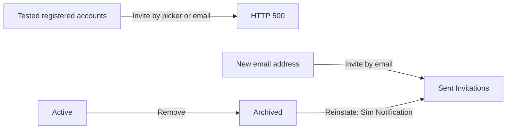
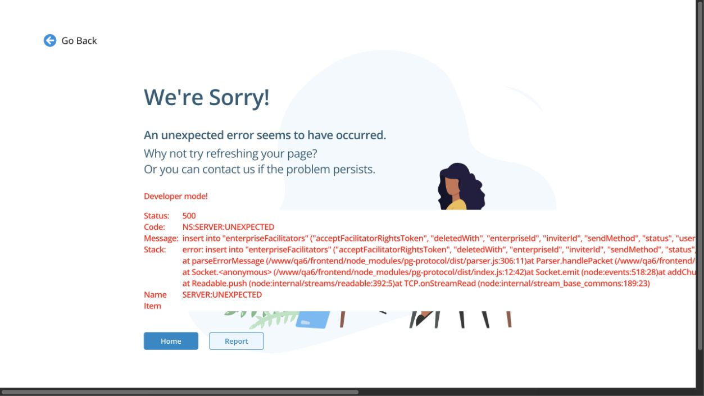

# NegotiationSim Facilitators — QA report

[Bug reports and test results](report.md) · [Screenshots](raw-evidence/README.md) · [Detailed test notes](raw-evidence/qa-report-full.md)

## Executive summary

The Facilitators page supports search, filtering, pagination, invitation management, and status changes. A new email address could be invited, and the message arrived in the test mail catcher. **Inviting an already registered account failed with HTTP 500 through both available invitation routes.** This prevented an end-to-end check of invitation acceptance and facilitator permissions. The error page also displayed internal database and server details.

Seven submissions to registered accounts returned HTTP 500: four through the account picker and three through the email form. This result is limited to the tested accounts and does not establish that every registered account is affected.

## Findings

| No. | Severity | Finding | State |
| --- | --- | --- | --- |
| **1** | High | Invitation of a registered account fails with HTTP 500 from both the account picker and email form. | Confirmed: 7/7 attempts across both routes. |
| **2** | Medium | The HTTP 500 page exposes internal database and server implementation details. | Confirmed during the failures in finding 1. |
| **3** | Medium | Identical facilitator rows appear twice in Active or Archived, including matching observed row identifiers. | Reproduced; product meaning of duplicate memberships needs clarification. |
| **4** | Medium | An invitation without the optional First Name appears as a blank, unidentified row in Sent Invitations. | Confirmed: 1/1 submission. |
| **5** | Observation | Two simultaneous pending invitations can be created for one email address. | Reproduced; intended business rule needs confirmation before classifying this as a defect. |

The [bug reports](report.md) give steps, expected results, actual results, and evidence for each finding.

## Coverage and results

| Area | Result |
| --- | --- |
| Access and navigation | All five supplied test accounts could sign in, switch enterprise, and open Facilitators. |
| Main list | Search, clearing search, Active/Sent Invitations/Archived sections, row menus, details, and pagination were exercised. |
| Existing-account picker | Search, individual filters, sorting, selection, deselection, and pagination worked. Submission failed for the tested registered accounts (**finding 1**). |
| Combined filters | I applied one **Aliases** filter and one **Negotiators** filter together. One matching row appeared; **Clear All** restored the list. This example cannot establish whether different filter categories use AND or OR, because the row matches both. |
| Email invitation | Required-field validation worked. A new-address invitation appeared under Sent Invitations and arrived in the test mail catcher; Resend generated another message. Existing-account submissions failed (**finding 1**). |
| Status actions | Withdraw removed test invitations. Remove moved one facilitator from Active to Archived. Reinstate moved tested archived records to Sent Invitations with method **Sim Notification**. Recipient-side rights were not verified. |
| Responsive UI | I checked approximately **1440, 768, and 390 px**: search, row menus, **+ Facilitator**, form closing, and pagination remained usable; I did not observe overlap. |
| Invitation acceptance and permissions | **Blocked.** The supplied registered recipients could not be invited because both routes returned HTTP 500. |

The [full report](report.md) records the responsive, combined-filter, and invitation checks.

## The blocked end-to-end flow

These are observed sender-side outcomes. The diagram does not imply that a recipient accepted an invitation or gained or lost facilitator permissions.

The following remains to be tested **after finding 1 is fixed**:

1. Under the sender account, confirm the intended recipient is absent from Active and Sent Invitations.
2. Invite one existing test account through the account picker and a different existing test account through **+ Email Invitation**, keeping the routes independent.
3. Confirm a success message, exactly one pending row per recipient, and the expected notification or test email.
4. Sign in as each recipient, accept the invitation, and verify the transition from Sent Invitations to Active and the actual facilitator capabilities.
5. Remove one accepted facilitator, verify the move to Archived **and** the loss of rights; then Reinstate and observe whether another acceptance is required.

Before sending to `test_user42` and `test_user43`, I found neither recipient in Active, Sent Invitations, or Archived. Both submissions returned HTTP 500, and no invitation or notification arrived for either recipient. Therefore, acceptance and recipient-side permission changes are **untested**, not passed.

## Screenshots

The invitation error is visible below. [See all screenshots](raw-evidence/README.md), including the selected account before submission and the empty search result afterward.

The screenshot shows the error page for one picker attempt. The [bug reports](report.md) distinguish that attempt from the other failed submissions. A screenshot cannot establish whether the server saved a partial invitation.

## Open product questions

1. Should **Reinstate** create a new pending Sim Notification invitation rather than restore Active rights immediately?
2. Can one person legitimately appear in both **Active** and **Sent Invitations**?
3. Can two pending invitations to the same email be valid? If so, how is the current link identified?
4. Can duplicate rows with the same record ID represent distinct memberships?
5. Should an email invitation without a first name display the email as its list label?
6. Should **Resend** display a success or failure confirmation?
7. Do filters from different categories combine with AND or OR?
8. Does the assignment's “+Facilitators tab” mean the current **+ Facilitator** button, or a separate tab?

The duplicate-invitation observation in finding 5 and the observed status transitions should not be classified as product defects until the intended rules are confirmed.

## Test-data changes and effort

Four email invitations created for new test addresses were withdrawn after verification. Two records were reinstated from Archived during testing and remained in Sent Invitations; they were not withdrawn because that would not restore their original state.

Testing and report preparation took approximately **130-150 minutes** overall.
