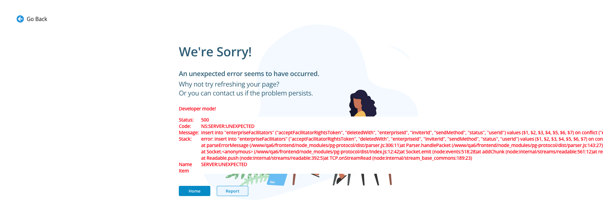

# NegotiationSim — Facilitators QA report

## Summary

I created a pending invitation for a new email address and confirmed its delivery in MailCatcher. Seven attempts to invite registered accounts returned HTTP 500: four through the account picker and three through the email form. I also found duplicate facilitator rows, a blank invitation row when the optional first-name field was empty, and duplicate pending invitations to the same address. The 500 page exposed internal SQL and server stack details. The invitation failure blocked my checks of recipient acceptance and facilitator rights.

| No. | Severity | Finding | Reproduced |
| --- | --- | --- | --- |
| 1 | High | Inviting an existing account fails with HTTP 500 through both add routes | 7 of 7 submissions: 4 picker, 3 email form |
| 2 | Medium | The 500 error page exposes SQL and server internals | Observed on multiple error pages; screenshot captured |
| 3 | Medium | Identical facilitator records appear twice in the same list | Multiple accounts; persists after reload |
| 4 | Medium | Email invitation without a first name produces an unidentified row | 1 of 1 attempt |
| 5 | Potential medium; confirm rule | The same email address can receive two simultaneous pending invitations | 1 of 1 duplicate attempt |

Severity reflects the observed impact in this test environment; product requirements and production reach were not available. Finding 5 is reproducible but remains a potential defect until the intended rule for repeated invitations is confirmed.

## Add-a-facilitator approaches

| Approach | Flow observed | Result |
| --- | --- | --- |
| Existing account | `+ Facilitator` → search or filter the account picker → select an account → `Send Invitation` | I found and selected accounts in the picker, but all four submissions to registered accounts returned HTTP 500 (finding 1). No successful invitation was confirmed. |
| Email address | `+ Facilitator` → `+ Email Invitation` → enter recipient email and optional first name/message → submit | For a new address, a pending row appeared under **Sent Invitations**, and MailCatcher received “Invitation for Enterprise Facilitator.” The message contained my custom text and a registration link. Leaving First Name empty exposed finding 4. Submissions to registered accounts `test_user42` and `test_user43` returned HTTP 500 (finding 1). Repeating a new address created duplicate invitations (finding 5). |

The first approach selects an existing account in the enterprise directory and offers account filters. The second accepts an email address, can carry a custom message, and creates a pending registration invitation for a new address. Neither approach successfully invited an existing registered account during this test.

## Detailed bug reports

### 1. Existing-account invitation fails with HTTP 500

**Preconditions:** I signed in to [QA6](https://qa6.negsim.com/user/login) as `test_user44@negotiations.com` for two picker attempts, `test_user41@negotiations.com` for two picker attempts and one email attempt, and `test_user45@negotiations.com` for two email attempts; The Negotiation Experts Enterprise selected; Settings → Facilitators open. I found no matching `test_user42` row in **Active** or **Sent Invitations** before a picker submission. List checks also showed neither `test_user42` nor `test_user43` in **Active**, **Sent Invitations**, or **Archived** before submissions to those accounts.

**Steps**

1. Click `+ Facilitator`.
2. In **Invite enterprise account facilitators**, search for `test_user18`.
3. Select **Admin18 User** (`test_user18@negotiations.com`). The picker shows `Selected: 1`. On a separate attempt, select **Admin6 User** (`test_user06@negotiations.com`) from the candidate list instead.
4. Click `Send Invitation`.
5. Independently, open `+ Email Invitation`, enter the already registered `test_user42@negotiations.com`, and submit.
6. Submit the email form a second time to check whether the failure persists.
7. Under `test_user41`, search the Facilitators page for `test_user42` and confirm that neither **Active** nor **Sent Invitations** contains a matching row. Open the existing-account picker, select **Admin42 User** (`test_user42@negotiations.com`), and click `Send Invitation`.
8. Reload Facilitators and search for `test_user42` again.
9. Under `test_user41`, search the main page for `test_user42` and `test_user43`, then try another picker invitation to `test_user42` and one `+ Email Invitation` submission to `test_user43@negotiations.com`.

**Expected result:** The invitation is accepted for processing, a success state is shown, and the person appears under **Sent Invitations** (or the UI explains a specific eligibility restriction before submission).

**Actual result:** All seven submissions to registered accounts ended on a “We're Sorry!” page with status **500**. The inspected error pages showed code **NS:SERVER:UNEXPECTED** and a database error: an `INSERT` into `enterpriseFacilitators` used `ON CONFLICT ("enterpriseId", "userId") DO NOTHING`, but “there is no unique or exclusion constraint matching the ON CONFLICT specification.” There was no success confirmation. The error page's **Go Back** control returned to Settings → General rather than the facilitator picker on the affected picker attempts. An email submission to `test_user42` produced no visible **Sent Invitations** row and no new MailCatcher message to that address. A second email submission showed the same status, code, and database error, with no pending row. Picker submissions under `test_user41` produced the same error. After reloading and searching again, `test_user42` still had no visible row in **Active** or **Sent Invitations**. I did not recheck MailCatcher after every picker attempt. The picker invitation to `test_user42` and email invitation to `test_user43` each returned HTTP 500; I received no invitations or notifications for either recipient. The [HTTP 500 screenshot](05-invitation-http-500.png) shows the same `NS:SERVER:UNEXPECTED` code and `enterpriseFacilitators` SQL conflict, but does not identify which of the two routes produced it.

**Impact:** Both observed ways to add a registered account were blocked, preventing me from completing the invitation and acceptance flow with the supplied second account. The selection is lost, and I must navigate back to Facilitators. **Frequency:** 7/7 submissions: four picker attempts (`test_user18`, `test_user06`, and twice for `test_user42`) and three email form attempts (twice for `test_user42`, once for `test_user43`). This does not prove every account fails.

**Picker evidence:** [Admin42 User selected before submission](01-account-selected.jpg), [no matching Active or Sent Invitations row after reload](03-no-matching-row.jpg).

**Additional error evidence:** [HTTP 500 screenshot](05-invitation-http-500.png). Both invitation routes failed; the single screenshot documents one error page but does not tie it to a specific route.

### 2. Internal database and stack details appear on the error page

**Steps:** Follow the steps for finding 1.

**Expected result:** A user-facing error with a correlation/reference ID and recovery guidance, without internal implementation details.

**Actual result:** The 500 page displays the SQL statement, table and column names, database error text, and a Node server stack path under `/www/qa6/frontend/node_modules/pg-protocol/`. The screenshot shows the same class of internal details.

**Impact:** Internal application structure is disclosed to a signed-in end user. This is a separate presentation/security issue even if the database failure in finding 1 is fixed. **Frequency:** These details were visible on multiple error pages, including the captured screenshot. I did not save a separate screenshot of every failed submission.

### 3. Duplicate facilitator rows in Active and Archived

**Preconditions:** Settings → Facilitators open. The duplicates were visible before any changes made during this test.

**Steps**

1. Inspect the **Active** table, or search for `Leonard Reilly`.
2. Observe the two identical **Leonard Reilly / LeonardReilly** rows on the same page; each displays job title **Legacy Usability Developer**, Ent **1**, Facilitated **9**, Classes **2**.
3. Reload the page and repeat. Also inspect **Adrien Borer** in Active and **Lester Carter** in Archived.

**Expected result:** One row per facilitator record in each status section, unless a distinct membership is explicitly identified.

**Actual result:** Leonard appears twice with the same HTML row ID `10689`. Adrien appears twice with row ID `10463`; Lester appears twice in Archived with row ID `11410`. Each pair has identical visible data, and the duplicates persist after reload. An exact-name search for Leonard still returns two rows.

**Impact:** Counts and pagination can be misleading, and duplicate action targets make it unclear which entry an administrator is changing. The matching row IDs strongly suggest the same records are rendered twice; I did not inspect the underlying data source.

### 4. Email invitation row is blank when First Name is omitted

**Preconditions:** Settings → Facilitators open; use an address not already invited.

**Steps**

1. Click `+ Facilitator` → `+ Email Invitation`.
2. Leave **First Name** empty. It is displayed as optional.
3. Enter `qa.facilitator.noname.20260926@example.com` in the required **Email** field and submit.
4. Find the new row under **Sent Invitations**, or use the page search for that email address.

**Expected result:** The pending row identifies the recipient, preferably by email when no first name was supplied; alternatively, First Name should be required before submission.

**Actual result:** Submission succeeded and [QA3 MailCatcher](https://qa3.negsim.com/mailcatcher) received the invitation, but the new Sent Invitations row (HTML row ID `-21`) had an empty **Facilitator** cell: no visible name or email. Search by the address found the row but did not display the address. The recipient address appeared in the **Withdraw** confirmation, but not in the list.

**Impact:** Administrators cannot identify or distinguish such invitations in the list. The test invitation was withdrawn after verification. **Frequency:** 1/1. Other pre-existing blank invitation rows were also visible, but their creation conditions were not verified.

### 5. Potential duplicate-invitation handling defect

**Preconditions:** Signed in as `test_user45@negotiations.com`; The Negotiation Experts Enterprise selected; no pending invitation for the new address.

**Steps**

1. Open `+ Facilitator` → `+ Email Invitation` and send an invitation to `qa.facilitator.duplicate.20260926@example.com` with First Name `QADuplicate`.
2. Search that address on the Facilitators page and confirm one pending row.
3. Repeat the email invitation with the same address and first name while the first invitation is still pending.
4. Search the same address again and inspect MailCatcher.

**Expected result:** The product rule is unconfirmed. If duplicate pending invitations are allowed, the list should distinguish them and make the valid link clear. If they are not allowed, the second submission should be prevented or update the existing invitation. The page already offers a **Resend** action.

**Actual result:** Both submissions succeeded. **Sent Invitations** showed two indistinguishable `QADuplicate` rows for the searched address, with distinct HTML row IDs `-22` and `-23`. MailCatcher received two separate “Invitation for Enterprise Facilitator” emails to the same address, 26 seconds apart. Each row had its own **Withdraw** action; withdrawing one left the other pending.

**Impact:** Administrators may send redundant mail and cannot tell which of the two pending invitations or links is current. Both test invitations were withdrawn after verification. **Frequency:** 1/1 duplicate attempt. The intended business rule for multiple pending invitations was not documented, so the expected outcome should be confirmed with the product team.

## Other checks and observations

| Check | Observed result |
| --- | --- |
| Navigation and sections | All five supplied accounts could sign in, switch to The Negotiation Experts Enterprise, and open Settings → Facilitators. Each saw **Active**, **Sent Invitations**, **Archived**, and `+ Facilitator`. |
| Search | Exact-name search narrowed facilitator rows; searching a pending invitation by recipient email found the row even when its displayed identity was blank. Clearing search restored the lists. |
| Existing-account picker | Search and the **Aliases** filter found `test_user18`; search also found `test_user42`. Candidate selection and deselection worked. The Facilitator sort icon sorted ascending (Aaron first) and descending (Zula first); page **102** loaded the final portion of the list. |
| Additional picker filters | Individually applying **Organization: Abernathy LLC** returned Ralph Gutkowski; **Countries: Afghanistan** returned Admin3 User and others; **Negotiators: Admin2 User** returned Admin2 User; a **Groups** filter returned Bernadette Orn and others. **Clear All** restored the unfiltered list between checks. With **Aliases: `test_user02`** and **Negotiators: `Admin2 User`** applied together, my [screenshot](04-combined-filters.png) shows both filter chips and exactly **one row**: **Admin2 User**, alias `test_user02`, email `test_user02@negotiations.com`. **Clear All** restored the full list. This result is consistent with an intersection, but because the sole row matches both conditions, this case does not distinguish AND from OR semantics. |
| Email form validation | An empty Email field showed `Required field`; `not-an-email` showed `Don't forget to include the '@'`. A valid address could be submitted. |
| Email delivery | A named test invitation appeared under **Sent Invitations** and in MailCatcher. `Resend` produced a second MailCatcher message. The UI showed no obvious confirmation after Resend. |
| Invitation withdrawal | The confirmation's Cancel preserved the row. Confirming Withdraw removed two test invitations; the two duplicate-invitation test rows were withdrawn one by one. Search found none afterward. |
| Active row details and removal | Expanding a row showed its associated classes. The Active row action menu offered **Remove**; confirmation Cancel preserved the row. Completing Remove on **test asdfasd** moved it from Active to Archived. |
| Archived action | **Reinstate** moved **Geraldine Morissette** and, separately, **test asdfasd** from Archived to **Sent Invitations** with method **Sim Notification**, rather than directly into Active. |
| Pagination | Changing Active list size from 25 to 10 displayed 10 rows and page controls; 25 was restored. Active page 2 loaded two different rows (**Jerrell Crooks** and **Denis Bartoletti-Cronin**) before returning to page 1. |
| Cross-account state | Under `test_user45`, search found **test asdfasd** in Sent Invitations after its Remove → Archived → Reinstate transition was performed under `test_user44`. |
| Duplicate rows and remaining invitations | Identical Active row IDs `10689` and `10463`, and Archived row ID `11410`, each remained visible twice. **Geraldine Morissette** and **test asdfasd** remained in Sent Invitations. Search found no leftover `qa.facilitator.duplicate.20260926@example.com` invitation. |
| `test_user42` before and after picker attempt | Signed in as `test_user41`, I searched Facilitators for `test_user42` and found no matching **Active** or **Sent Invitations** row. I then selected **Admin42 User** in the picker and submitted. The same HTTP 500 appeared. After reload, another search still showed no matching row in either section. |
| Invitations to `test_user42` and `test_user43` | Neither recipient appeared in **Active**, **Sent Invitations**, or **Archived** before these attempts. Under `test_user41`, one picker invitation to `test_user42` and one email invitation to `test_user43` each led to HTTP 500. I received no invitation or notification. My [screenshot](05-invitation-http-500.png) shows one 500 response with SQL and stack details; it does not identify its route. I could not exercise acceptance, recipient rights, Remove, or Reinstate on these accounts. |
| Search for supplied accounts | Under `test_user41`, I searched the main Facilitators page for `test_user4` and found no visible rows under **Active**, **Sent Invitations**, or **Archived** after results loaded. This does not establish the state of accounts outside that search or another enterprise. |
| Responsive layout | In a regular browser at approximately **1440, 768, and 390 px**, I checked search, row `…` menus, `+ Facilitator`, closing the form, and pagination. These controls and the combined-filter check worked; I found no inaccessible control or text/button overlap. |

## Questions for the product team

1. Is **Reinstate** intended to create a new pending Sim Notification invitation rather than restore Active rights immediately? The UI did not explain this transition before the action.
2. Should **First Name** be mandatory for email invitations, or should the recipient email be the fallback label in **Sent Invitations**?
3. Are identical rows with the same record ID ever valid because of multiple memberships, or should each record appear once per section?
4. Should **Resend** show a success or failure message? A second email was delivered, but the page gave no obvious feedback.
5. The task description calls **Facilitators** and **+Facilitators** “tabs.” Is a separate `+Facilitators` tab expected, or does it refer to the current `+ Facilitator` button?
6. Should the email form allow more than one pending invitation to the same address? If yes, how should administrators distinguish them and know which link is valid?
7. Should a facilitator appear simultaneously under **Active** and **Sent Invitations**? **Denis Bartoletti-Cronin** appeared in both sections with HTML row ID `10000`; I did not change this record or determine whether distinct rights are represented.
8. Are multiple picker filter categories intended to combine with AND or OR? Applying **Aliases: `test_user02`** and **Negotiators: `Admin2 User`** returned one account matching both, so that result alone does not establish the rule.

## Test data and limits

- Testing and report preparation took approximately 130-150 minutes overall.
- Four email invitations created for this test (one named, one without a first name, and two duplicates) were withdrawn after verification. No registration link was opened.
- **Geraldine Morissette** and **test asdfasd** were reinstated from Archived during the test and remain in **Sent Invitations**. I did not withdraw them because that would not restore their original states.
- I exercised all five supplied logins. I attempted seven invitations to registered accounts: picker submissions for `test_user18` and `test_user06` under `test_user44`, two picker submissions for `test_user42` under `test_user41`, two email submissions for `test_user42` under `test_user45`, and one email submission for `test_user43` under `test_user41`. All returned HTTP 500. No invitation to `test_user42` or `test_user43` was confirmed as created, and I received no notification. Acceptance, recipient rights, and Remove/Reinstate on these accounts remain untested. I observed Remove and Reinstate list transitions on other records but did not verify the recipient's actual loss or restoration of rights. My results do not prove that every selectable existing account fails.
- I checked responsive layout in a regular browser at approximately 1440, 768, and 390 px; I did not record the browser name. My combined-filter screenshot shows one matching account, **Admin2 User** (`test_user02`), and **Clear All** restored the full list. The screenshot before the picker attempt documents no matching **Active** or **Sent Invitations** row for `test_user42` under `test_user41`; I saw the same visible state after the failed submission.
- Follow-up after finding 1 is fixed: invite a supplied second account through each route, inspect delivery/notification, accept as the recipient, verify the Active row and role permissions, then verify Remove revokes those permissions and observe the Reinstate transition. These end-to-end checks remain blocked by HTTP 500.
- No production environment was used. Credentials and invitation tokens are intentionally excluded from this report.
